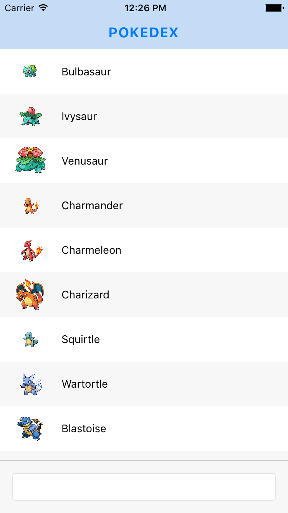

## Building the Main Listing

Now that we have our navigator in place, we can start building out our components. First on the menu will be the Pokedex component defined as the default in our Navigator, and we'll define Pokedex as a container component at `/src/containers/Pokedex.js`.

We'll chiefly be using a [**ListView**](https://facebook.github.io/react-native/docs/listview.html), a React Native core component that extends a more primitive [**ScrollView**](https://facebook.github.io/react-native/docs/scrollview.html), and primarily allows us to efficiently display long lists of data.

    

