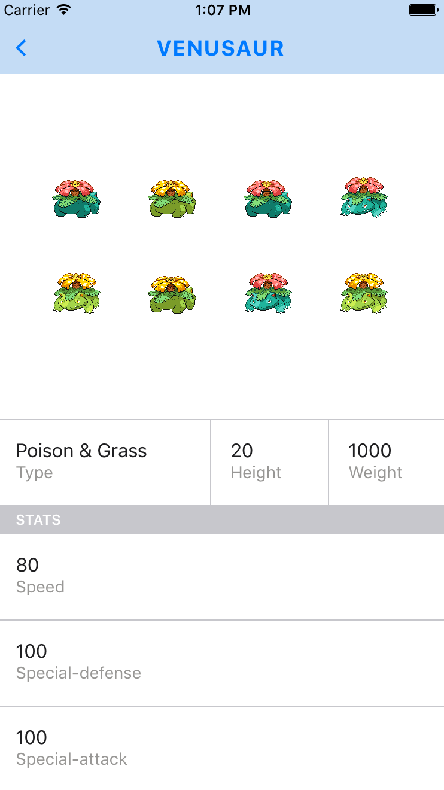

# Setting up our Pokemon Detail View

We can now start setting up the detail view for individual pokemon selected in from the list. In order to do this, we'll have to make use of a new React Native component. The `ScrollView` component!

A scroll view is similar to the `ListView` component we have used already, but it has a few differences. To start, the `ListView` component is used when you have long lists of changing data. It has optimizations that make it more efficient for this type of data. The `ListView` also brings the ability to separate your content into sections, as well as displaying section headers. The `ScrollView` on the other hand, is just for displaying content of various heights inside a fixed height container. These components are better to use if you have data that isn't likely to change much.

## ScrollView API

An important prop to be aware of for the `ScrollView` is the `contentContainerStyle` prop. This prop will pass your styles over to the container element that will wrap your `ScrollView`'s child elements. This is a good place to pass styles such as `justifyContent` or `alignItems`.

You can [find out more about the ScrollView's props here.](https://facebook.github.io/react-native/docs/scrollview.html)

Using the `ScrollView` component, let's setup the display for our Pokemon's abilities and stats!

    

